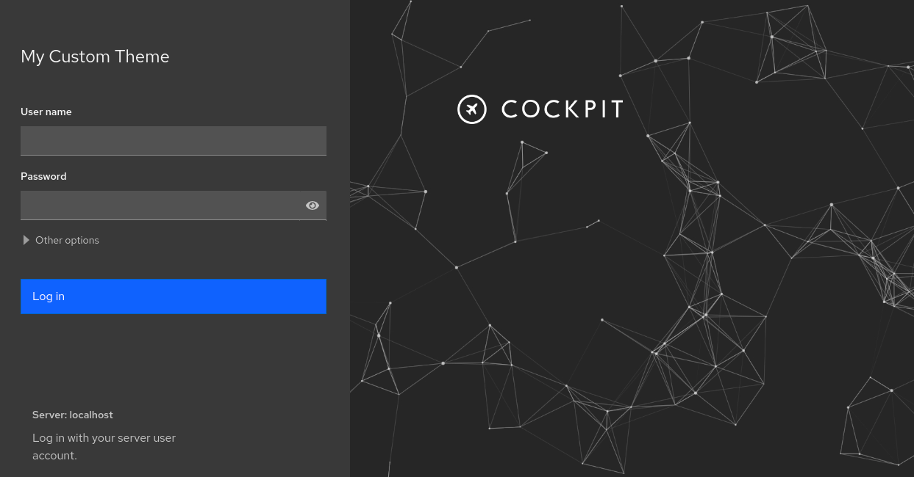

# Cockpit branding example

This is an example project for customizing the Cockpit theme.

## Install

The contents of `/src` folder need be copied to `$prefix/share/cockpit/branding/$ID-$VARIANT_ID`
where `$ID` and `$VARIANT_ID` variables depend on your OS and are those listed in `/etc/os-release`, and `$prefix` is usually `/usr`.